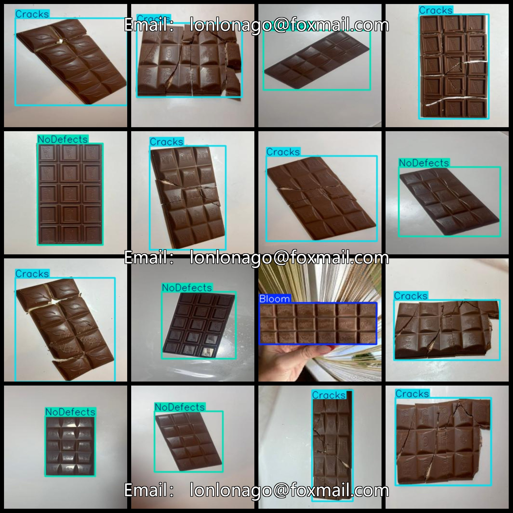
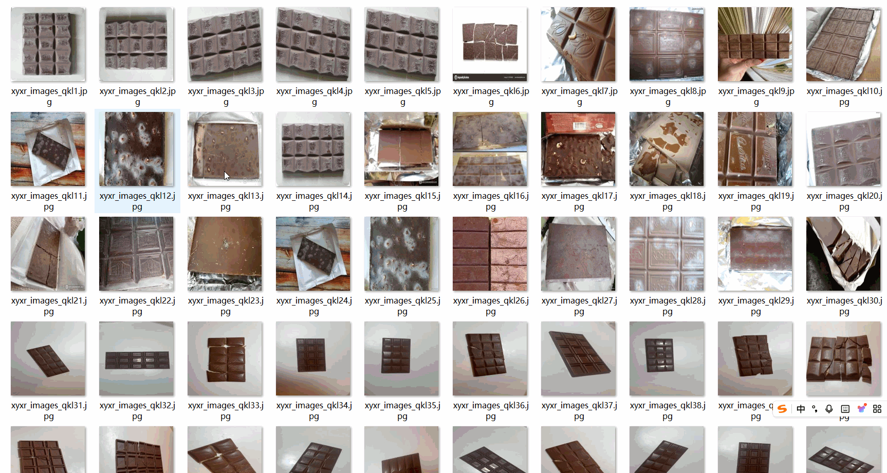

# [Object Detection] Chocolate Defect Dataset
1153 images in YOLO+VOC format

The dataset format includes both VOC and YOLO formats.

The package contains three folders, each storing images, XML files, and TXT files.

In the JPEGImages folder, there are a total of 1153 jpg images.

In the Annotations folder, there are a total of 1153 XML files.

In the labels folder, there are a total of 1153 TXT files.

There are a total of 4 label categories: ["Bloom", "Cracks", "Moth", "NoDefects"]

The label names are: ["Bloom", "Cracks", "Moth", "NoDefects"]

The number of boxes (note that the order of classes in the YOLO format does not correspond to this, but is based on the classes.txt in the labels folder):

- Bloom boxes = 22
- Crack boxes = 610
- Moth boxes = 7
- NoDefect boxes = 559
- Total boxes = 1198

The image resolution is clear (pixel size).

The images have not been enhanced.

The shape of the labels is a rectangular box, used for object detection recognition.

Important Note: There is no provision for any guarantee of model training accuracy or weight file precision. The dataset provides accurate and reasonable annotations only.

Annotation and Image Details:

## Images

---

Here is a pay link on Stripe (https://buy.stripe.com/3cs8yP7sY87d0vu9AB). Please contact me lonlonago@foxmail.com after funding $89, and I will send you a complete data files, thank you!

